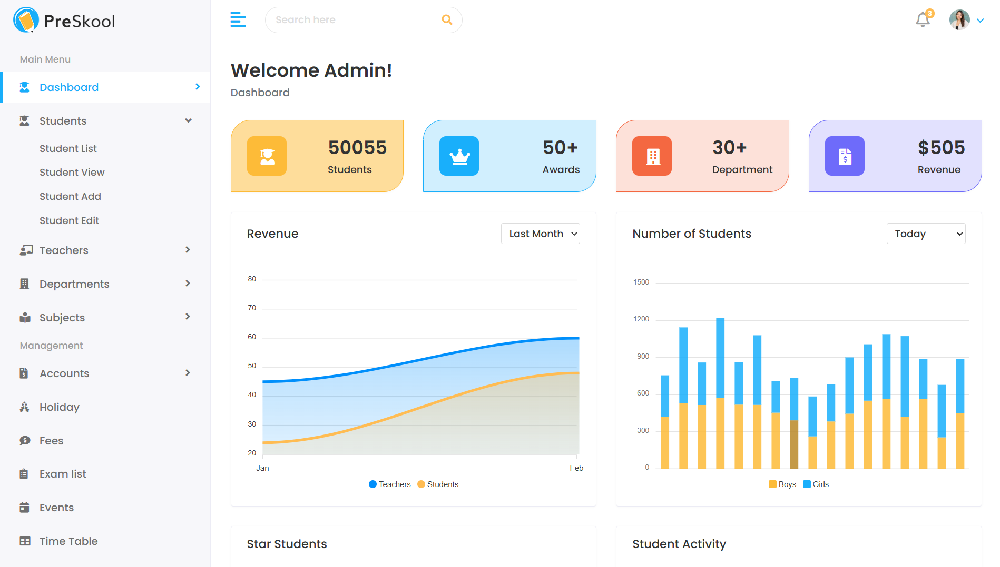

# 🏫 School Management System




> ⚠️ **Project Status: INCOMPLETE**  
> This project is currently under development and  **not yet complete**. 
>just **student section & authentication(account) section is done!** 
> Feel free to fork, contribute, or add your own features according to your specific needs!

---

## 📋 Overview
A comprehensive Django-based School Management System designed to streamline administrative tasks, student management, and academic operations. This system provides a foundation for managing students, teachers, courses, and various school-related activities.

## ✨ Features (Current & Planned)

### ✅ Implemented
- **User Authentication**
  - Custom user registration & login
  - Secure authentication system
- **Student Management**
  - Add/edit/view student records
  - Student dashboard
  - Student details view
- **Basic Admin Interface**
  - Django admin panel integration
- **Responsive Design**
  - Bootstrap-based UI
  - Mobile-friendly templates

### 🚧 In Development
- Teacher management system
- Course & subject management
- Attendance tracking
- Grade management
- Fee collection system
- Library management
- Event calendar
- Report generation

### 🔮 Future Enhancements
- Parent portal
- SMS/email notifications
- Online examination system
- Timetable generation
- Inventory management
- Multi-school support

## 🛠️ Technology Stack

- **Backend:** Django 4.x
- **Frontend:** HTML5, CSS3, JavaScript
- **UI Framework:** Bootstrap 5
- **Database:** SQLite (default), PostgreSQL (production-ready)
- **Icons:** Font Awesome
- **Charts:** ApexCharts

## 🚀 Quick Start

### Prerequisites
- Python 3.8+
- pip (Python package manager)

### Installation

1. **Clone the repository**
   ```bash
   git clone https://github.com/yourusername/school-management-system.git
   cd school-management-system
   ```

2. **Create virtual environment**
   ```bash
   python -m venv venv
   source venv/bin/activate  # On Windows: venv\Scripts\activate
   ```

3. **Install dependencies**
   ```bash
   pip install -r requirements.txt
   ```

4. **Run migrations**
   ```bash
   python manage.py makemigrations
   python manage.py migrate
   ```

5. **Create superuser**
   ```bash
   python manage.py createsuperuser
   ```

6. **Start development server**
   ```bash
   python manage.py runserver
   ```

7. **Access the application**
   - Main site: http://localhost:8000
   - Admin panel: http://localhost:8000/admin

## 📁 Project Structure

```
school-management-system/
├── accounts_auth/          # User authentication app
├── core/                   # Django project settings
├── school/                 # School management app
├── student/                # Student management app
├── static/                 # Static files (CSS, JS, images)
├── templates/              # Base templates
├── requirements.txt        # Python dependencies
└── manage.py              # Django management script
```

## 🤝 Contributing

Since this is an incomplete project, contributions are highly welcome! Here's how you can help:

1. **Fork the repository**
2. **Create a feature branch**
   ```bash
   git checkout -b feature/your-feature-name
   ```
3. **Make your changes**
4. **Test thoroughly**
5. **Submit a pull request**

### Ideas for Contribution
- Complete unfinished features
- Add new modules (library, transport, hostel)
- Improve UI/UX design
- Add comprehensive tests
- Write documentation
- Optimize performance
- Add API endpoints

## 📝 Customization Guide

### Adding New Features

1. **Create new Django app**
   ```bash
   python manage.py startapp your_app_name
   ```

2. **Add to INSTALLED_APPS in `core/settings.py`**

3. **Create models in `models.py`**

4. **Create views in `views.py`**

5. **Add URL patterns in `urls.py`**

6. **Create templates in `templates/` directory**

### Styling Guidelines
- Follow existing Bootstrap 5 patterns
- Use consistent color scheme
- Maintain responsive design
- Use Font Awesome icons

## 🐛 Known Issues

- Some features are placeholders
- UI/UX needs refinement
- Missing comprehensive tests
- No API documentation yet

## 📄 License

This project is open source and available under the [MIT License](LICENSE).

## 🙋‍♂️ Support

For questions, suggestions, or contributions:
- Open an [issue](https://github.com/yourusername/school-management-system/issues)
- Create a [discussion](https://github.com/yourusername/school-management-system/discussions)
- Submit a pull request

---

**Remember:** This project is a work in progress. Use it as a foundation and build upon it according to your specific requirements!
